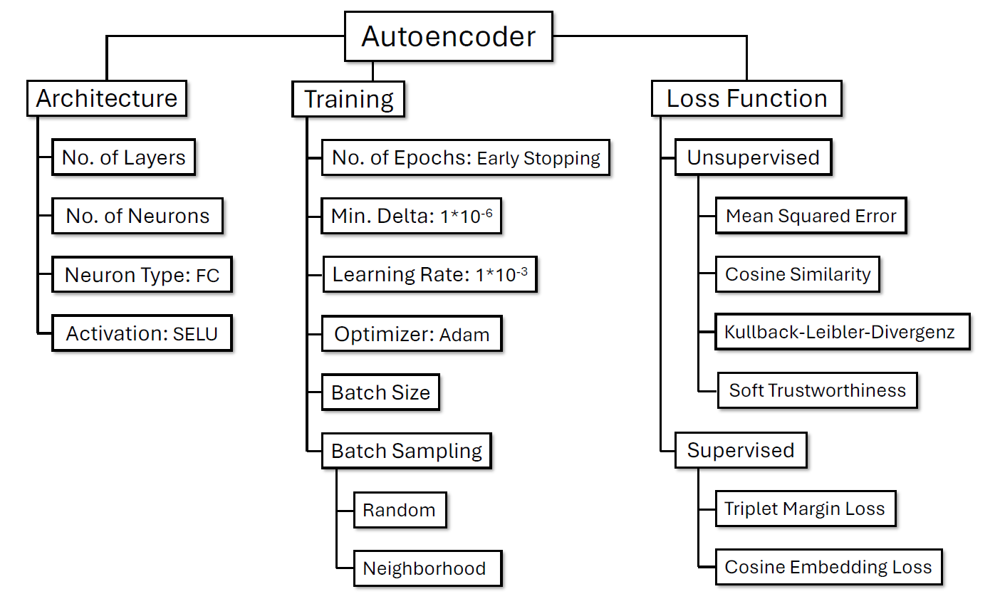

# Master Thesis (LaTeX project)

Short repository for a Master's thesis written in LaTeX. This repo contains the source files, figures and data used to build the [final PDF](Masterarbeit___Atakan_Kara.pdf) of the thesis.

## What this repository contains

- `main.tex` — top-level LaTeX file (entry point)
- `0_abstract.tex`, `1_introduction.tex`, `2_theoretical_foundation.tex`, `3_related_work.tex`, `4_method.tex`, `5_experiments.tex`, `6_conclusion.tex`, `7_appendix.tex` — chapter/source files
- `5.1_rq1.tex`, `5.2_rq2.tex`, `5.3_rq3.tex` — experiment sub-sections used from `5_experiments.tex`
- `bibliography.bib` — BibTeX bibliography file
- `images/` — directory with figures and dataset visualizations (subfolders: `datasets`, `RQ1`, `RQ2`, `RQ3`)

### Roadmap

The project roadmap is included as a PDF in the repository and can be viewed below.

  

